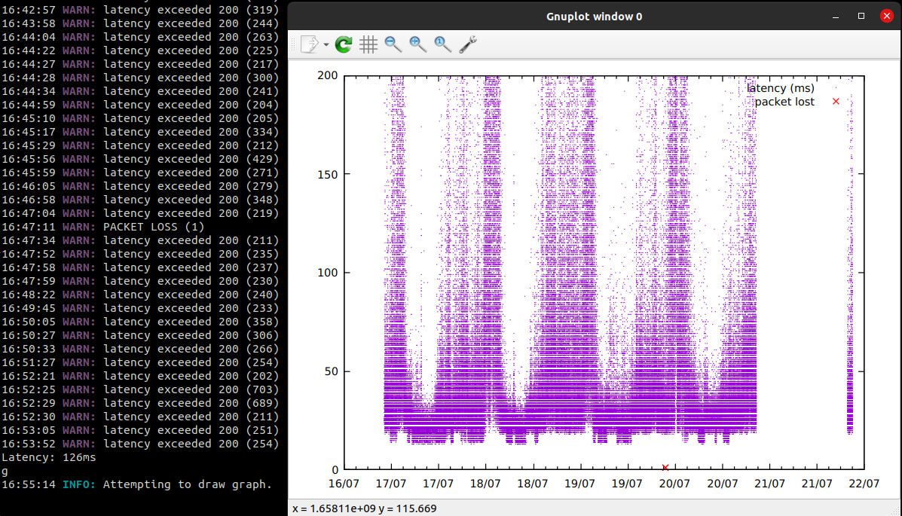

# pingstat
Lightweight latency tester for visualizing network stability over large time-frames
### What it does
pingstat pings a remote server at a given frequency using the ping program from the iputils package. \
It writes the latency (or loss) of each packet to a file in a binary format. \
This can then be graphed using the 'g' command (using gnuplot by default). Alternatively, it can be read using a separate program \
The most recent ping's latency is optionally updated in stdout. \
Warnings for high ping, loss, or errors are sent to stderr. 
### Why it exists
From what I've seen, most apps/tools that collect network statistics don't do all of the following
1. Collect data over very large periods of time
2. Run with low network impact (no download/upload speed tests)
3. Visualize data only when needed
4. Does not require elevated privileges
### How data is stored
Data is written with format '%long%int%int'. In order, these values are:
1. unix timestamp
2. latency of the recieved packet, if recieved
3. loss, negative if not lost, positive if lost

This format is used for ease of use with gnuplot

Note that the following example is missing data due to a power outage.
